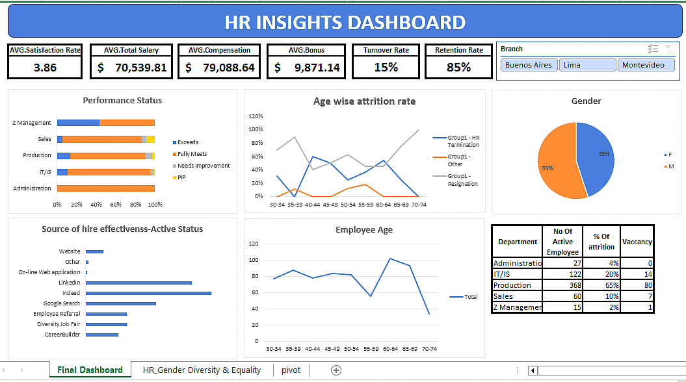

# HR Insights Dashboard  
This Excel-based HR Insights Dashboard provides key HR metrics, including:  

- Employee attrition & retention rates  
- Performance tracking across departments  
- Gender diversity analysis  
- Source of hire effectiveness  
- Age-wise employee distribution  

## Preview  
  

## How to Use  
- Open the Excel file and explore the data visualization.  
- Modify the dataset to analyze different HR trends.  

## Tools Used  
- Microsoft Excel  
- Data Visualization & Analytics  

Feel free to reach out for feedback or collaboration! 🚀  
